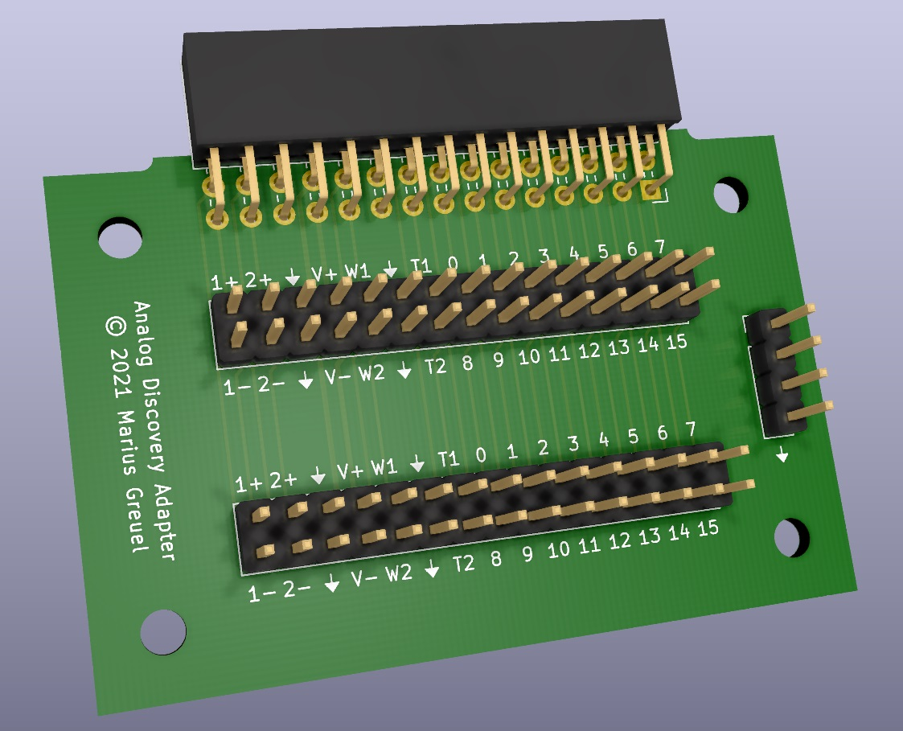

# Pin Header Adapter for Analog Discovery USB Oscilloscope

I own an [Analog Discovery 2](https://digilent.com/shop/analog-discovery-2-100ms-s-usb-oscilloscope-logic-analyzer-and-variable-power-supply/) USB oscilloscope and logic analyzer from [Digilent](https://digilent.com/), which is a fantastic little device for all sorts of Arduino style activity. To connect the Analog Discovery to your devices, the flywire cables works very well.

However, I tend to use longer cables, and I rarely have all cables connected. To connect cables individually, I found it easier to connect them from the top, so I build a little adapter that switches orientation of the pin header connector. As a bonus, I added a second connector, so you no longer need a V-cable if you have more than one connection on a single pin.

The rendered image of the adapter looks like this:

## KiCad schematic and PCB

You can find the KiCad schematic and PCB layout files in the [PCB folder](./pcb).

## Gerber Files

If you just want to build an adapter yourself, you can use my [Gerber Plots](./pcb/discovery_adapter_gerber.zip) and send them to your favorite PCB manufacturer.

## License

The Pin Header Adapter schematic and PCB layout is released under the GNU GPLv3.

Copyright 2021 Marius Greuel.
